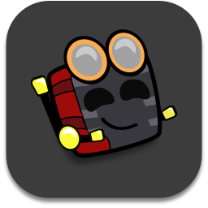

 

 

<h1 align=center><strong>Spectrasonic</strong></h1>

 

## Acerca de mi

Hola soy **_Spectrasonic_**...

🎓Estudio **Ingenieria Robotica** en la **Universidad Politecnica de Yucatán**
📍 Vivo en la ciudad de Merida en México

Algunos de los Lenguajes que Domino son:

- html
- css
- php
- java
- lua
- c#

Gusto de escuchar mucha musica en todo momento.
Los generos de musica que me gustan son:

- Trance 🎵
- Synthwave 🎵
- Lo-Fi 🎵
- Vaporwave 🎵
- R&B 🎵

## Contacto

Puedes contactar comingo via por etiqueta o via DM o simplemete seguirme en estas redes sociales:

- [Twitter][1]
- [Instagram][2]
  Discord como: Spectrasonic#8495

### Dev Now

- Estoy Desarrollando el bot de discord [Omnispectra][4]v1.14.0 (Repositorio Público)
- Estoy Desarrollando un bot de discord para el servidor de [ColorfulPanic][5]v0.2.0 PreAlpha (Repositorio Privado de momento)
- Desarrollo del Plugin Redstonium Core para Dramacraft
- Minecraft Datapack para el servidor de Dramacraft
- Minecraft Datapack para el servidor de [ColorfulPanic][5]

### Extras

- Tengo un album de Studio totalmente producido por mi en mi pagina de [Bandcamp][3]
- Uso **Ableton Live** para producicon de musica
- Tengo una cuenta en **Gitlab** tambien
- Uso el Suite de Diseño Grafico de **Affinity** (Mas estable que la de Adobe)

---

  with  by <b>Spectrasonic</b>

<!--Links-->

[1]: https://twitter.com/spectrasonic117
[2]: https://instagram.com/spectrasonic117
[3]: https://spectrasonic.bandcamp.com/album/endless-summer
[4]: https://github.com/spectrasonic117/Omnispectra
[5]: https://twitter.com/colorful_panic
